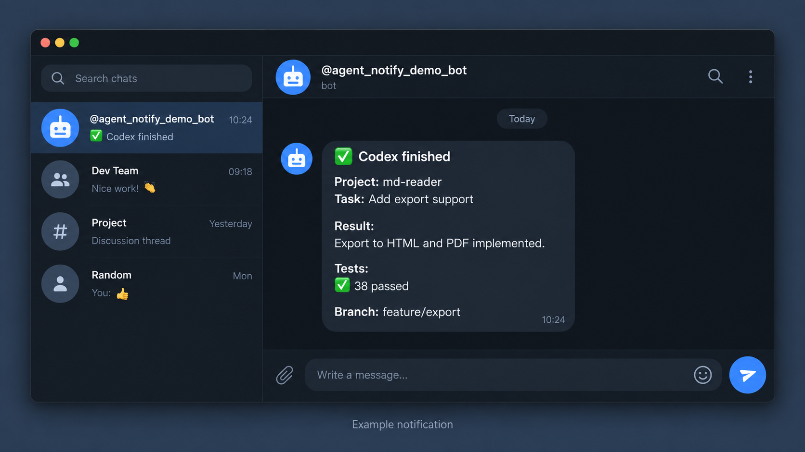
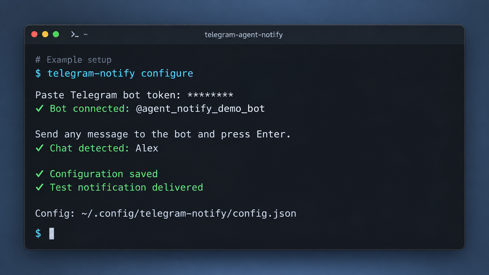
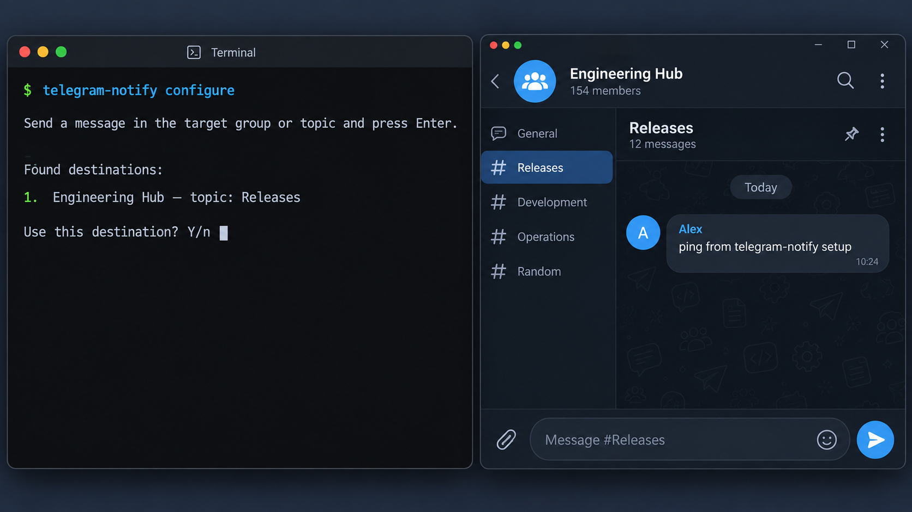
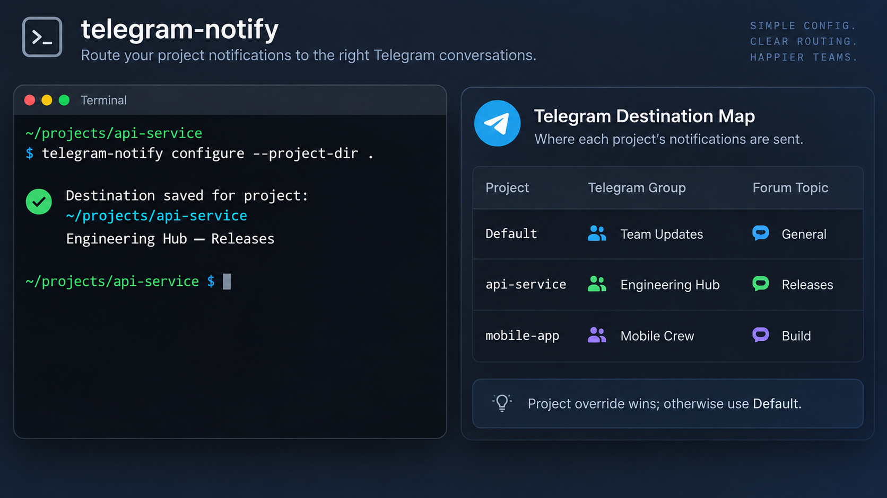

# telegram-agent-notify

Небольшой Telegram-уведомитель без зависимостей для Codex CLI, Claude Code и других coding agents.

[English README](README.md) · [MIT License](LICENSE)

Агент отправляет одно короткое резюме после завершения задачи и затем возвращает обычный финальный ответ. Вывод команд и промежуточный прогресс не пересылаются.

Все изображения используют только демонстрационные данные.





Мастер настройки находит группу и тему по сообщению, отправленному в нужное место:



Разные проекты могут использовать разные группы и темы, сохраняя общий default:



## Установка

Требуется Python 3.9+. Runtime-зависимостей и `pip install` нет.

```bash
git clone https://github.com/SpNkd/telegram-agent-notify.git
cd telegram-agent-notify

# Только Codex
./install.sh --yes --codex

# Codex и Claude Code
./install.sh --yes --codex --claude
telegram-notify configure
```

В Windows используйте `powershell -ExecutionPolicy Bypass -File .\install.ps1`.

## Настройка Telegram

1. Откройте [@BotFather](https://t.me/BotFather), выполните `/newbot` и скопируйте токен.
2. Запустите `telegram-notify configure` и вставьте токен в скрытое приглашение.
3. Отправьте сообщение в нужное место: боту в личный чат либо в целевую группу/тему.
4. Нажмите Enter в терминале. Утилита сама найдёт группу и тему по свежему Telegram update.
5. Подтвердите параметры и отправьте тестовое уведомление.

Для темы группы сообщение нужно отправить именно внутри этой темы. Бот должен видеть сообщение: при включённом privacy mode отправьте команду/упоминание, дайте боту права администратора или измените privacy mode в BotFather.

Идентификаторы искать вручную не нужно. Мастер получает `chat_id` и `message_thread_id` из сообщения, которое вы отправили в нужное место.

## Дефолт и разные назначения для проектов

Обычная настройка — общий destination:

```bash
telegram-notify configure --default
```

Отдельный destination для текущего Git-проекта:

```bash
cd ~/projects/my-app
telegram-notify configure --project-dir .
```

Команды `send` и `completion`, запущенные внутри настроенного проекта, используют его группу/тему. Если соответствующего проекта нет, используется default. Для диагностики можно указать `telegram-notify status --project-dir /path/to/project`.

Конфигурация хранится вне репозитория:

- macOS/Linux: `~/.config/telegram-notify/config.json` или `$XDG_CONFIG_HOME/telegram-notify/config.json`;
- Windows: `%APPDATA%\telegram-notify\config.json`.

Файл записывается атомарно и на POSIX получает права `0600`. Токен не попадает в репозиторий.

## Ошибка SSL на macOS

Если появляется `CERTIFICATE_VERIFY_FAILED` с текстом про self-signed certificate, обычно HTTPS перехватывает корпоративный proxy. Получите у администратора корневой сертификат proxy в формате PEM и укажите его:

```bash
telegram-notify configure --ca-file /path/to/corporate-root-ca.pem
# или
export TELEGRAM_NOTIFY_CA_FILE=/path/to/corporate-root-ca.pem
```

Если это заведомо доверенная локальная сеть и вы принимаете риск, можно явно отключить проверку для Telegram-запросов:

```bash
telegram-notify configure --insecure-tls
```

Настройка сохранится в локальном конфиге. Вернуть проверку можно так:

```bash
telegram-notify configure --secure-tls
```

Режим отключает проверку сертификата и имени хоста. Не используйте его в недоверенной сети.

## Команды

```bash
telegram-notify configure
telegram-notify test
telegram-notify status
telegram-notify doctor
telegram-notify disable
telegram-notify enable
telegram-notify completion --status success --task "..." --summary "..."
telegram-notify send-file ./report.md --caption "Full report"
```

`send-file` работает только по явному запросу, ограничен 10 MiB и блокирует очевидные имена секретов (`.env`, `*.pem`, `*.key`, `credentials*`, `secrets*`) без `--force`.

## Codex и Claude Code

Инсталлятор размещает skill в `~/.agents/skills/telegram-notify` и `~/.claude/skills/telegram-notify`. В запросе достаточно написать:

```text
Выполни задачу полностью. После завершения отправь через telegram-notify краткое резюме результата.
```

Skill отправляет одно сообщение после завершения работы, не заменяя обычный финальный ответ агента.

## Разработка

```bash
python3 -m unittest discover -s tests -v
python3 telegram_notify.py --help
python3 telegram_notify.py --version
```

CI проверяет проект на Ubuntu, macOS и Windows с Python 3.9–3.13.

## Лицензия

MIT. Подробности в [LICENSE](LICENSE).
